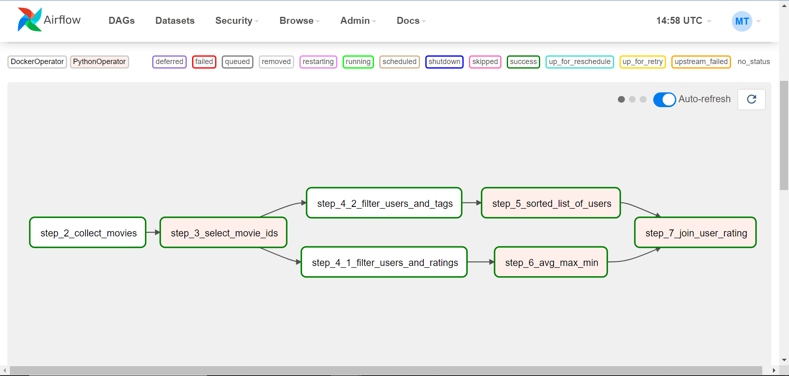

## The main goals were: 
   * Showing your skills working with Python and 3rd party libraries
   * Showing your skills working with external APIs, creating a python package to encapsulate the 
   business logic.  
   * Of course, good documentation, code quality and testing practices are very welcome. 
## But it turned out with some additional challenges, like:
   * Build memory friendly (fast and resilient) solution. 
   * Build solution which can run with 8Gb RAM and 10GB storage. (Used by Docker, Airflow, WSL etc)
   * Space and Time complexity is between O(n) to O(n * k). (Where n = rows of single dataframe and k = rows of 2 dataframe, usually used in `pd.concat()` function

## Summary:

   I mainly used Windows 10 i5 6th gen 8GB machine for this task. The task were successfully done with the help of WSL2, Docker v4.18.0, Airflow v2.5.3, Python 3.8. MovieLens Data was used in this project. For ratings.csv file i was getting following error `"airflow.exceptions.AirflowException: Docker container failed: {'Error': None, 'StatusCode': 137} lines" Exit code 137 occurs when a process is terminated because it's using too much memory.` hence i read it in phases. Total records were `25000095`


## Part 1

### 1. Docker setup
   1. Build the Docker image:
      ```
      docker build -t iib_part1 .
      ```
   2. Create a container:
      ```
      docker container create -i -t --name iib_part1_container iib_part1
      ```
   3. Start the container:
      ```
      docker start iib_part1_container
      ```
   4. Execute docker container:
      ```
      docker exec -it iib_part1_container bash
      ```
### 2. Check the contents of the iibflix directory:
   ```
   iibflix ls
   ```

### 3. Filter tags by movie ID: 
      
      ```iibflix filter-tags -f tags.csv -m [7569]```
      
      This will return a table with movie ID, user ID and tag.
      ```
      movieId,userId,tag
      7569,4,so bad it's good
      7569,6550,asia
      7569,6550,assassin
      7569,6550,assassination
      7569,6550,blast
      ```
### 4. Filter ratings:
   1. Filter ratings by movie ID:
      ```
      iibflix filter-ratings -f ratings.csv -m [7569]
      ```
      This will return a table with user ID, movie ID, and rating.
      ```
      userId,movieId,rating
      4,7569,3.5
      43,7569,3.0
      59,7569,3.0
      76,7569,3.5
      519,7569,4.0
      ```
   2. Filter ratings by user ID:
      ```
      iibflix filter-ratings -f ratings.csv -u [4]
      ```
      This will return a table with user ID, movie ID, and rating.
      ```
      userId,movieId,rating
      4,1,3.0
      4,260,3.5
      4,296,4.0
      4,541,4.5
      4,589,4.0
      ```
   3. Filter ratings by both user ID and movie ID:
      ```
      iibflix filter-ratings -f ratings.csv -m [7569] -u [4]
      ```
      This will return a table with user ID, movie ID, and rating.
      ```
      userId,movieId,rating
      4,7569,3.5
      ```
### 5. Filter movies by genre, year, and/or movie ID:
   1. Filter movies by year:
      ```
      iibflix filter-by-genre-year-movie-id -f movies.csv  -y [2012]
      ```
      This will return a table with movie ID, title, and genre.
      ```
      movieId,title,genres
      89745,"Avengers, The (2012)",Action|Adventure|Sci-Fi|IMAX
      91483,Bullet to the Head (2012),Action|Crime|Film-Noir
      91485,"Expendables 2, The (2012)",Action|Adventure
      91500,The Hunger Games (2012),Action|Adventure|Drama|Sci-Fi|Thriller
      91529,"Dark Knight Rises, The (2012)",Action|Adventure|Crime|IMAX
      ```
   2. Filter movies by genre and year:
      ```
      iibflix filter-by-genre-year-movie-id -f movies.csv -g "comedy,drama" -y [2012]
      ```
      This will return a table with movie ID, title, and genre.
      ```
      movieId,title,genres
      91873,Joyful Noise (2012),Comedy|Musical
      91937,Loosies (2012),Comedy|Drama|Romance
      92264,One for the Money (2012),Action|Comedy|Crime
      92665,"For a Good Time, Call... (2012)",Comedy|Drama|Romance
      92681,Journey 2: The Mysterious Island (2012),Action|Adventure|Comedy|Sci-Fi|IMAX
      ```

   3. Filter movies by genre, year, and movie ID:
      ```
      iibflix filter-by-genre-year-movie-id -f movies.csv -g "comedy,drama" -y [2012] -m [112729]
      ```
      This will return a table with movie ID, title, and genre for a specific movie ID.
      ```
      movieId,title,genres
      112729,If I Were You (2012),Comedy|Drama
      ```

## Part 2

### 1. Put "iibflix_runner.py" inside airflow's dag folder
   ```
   YourDirectoryPath/airflow/dags/iibflix_runner.py
   ```
### 2. I assume you have already working airflow setup in your system. So
   1. Initialize database
   ```
   airflow db init
   ```
   2. Run webserver
   ```
   airflow webserver
   ```
   3. Run Scheduler
   ```
   airflow scheduler
   ```
   4. Go to your airflow UI and run the dag. At the end you will see the result similar like that:
   
   5. Lastly, go to XCOM tab and find the path of file exported csv file for your referece.

